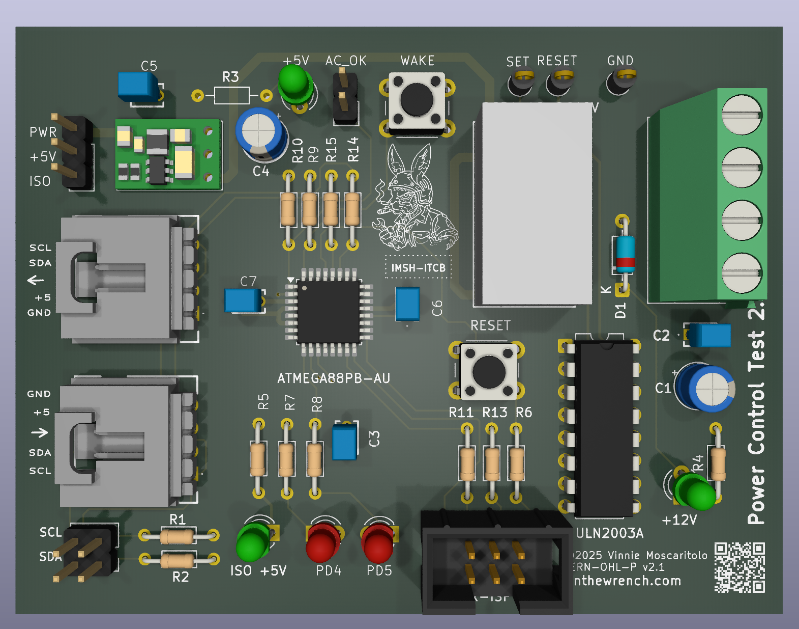

This repository contains a hardware power controller that enforces safe, predictable power-on and power-off behavior for a Raspberry Pi used in real-world automation systems.

It grew out of the work described in [Raspberry Pi Internet of Things – Part 029](https://www.vinthewrench.com/p/raspberry-pi-internet-of-things-part-029), where the problem wasn’t software, but power: a Pi running irrigation, valves, radios, or sensors cannot simply lose power without consequences. Filesystems corrupt, tasks stop mid-cycle, and batteries get drained dry.

The design documented here takes those ideas further by moving power control out of the Pi and into a small, dedicated controller. The Pi decides when it is safe to shut down; the hardware enforces when power is actually applied or removed. A latching relay does the physical switching, while simple signals coordinate startup, shutdown, and recovery when utility power fails or returns.

The result is a Raspberry Pi that behaves like part of a system, not a hobby board dangling from a power supply.
 
## Repository Layout

```
.
├── Power_Controller_Design_Document_v1.1.md
├── README.md
├── code/
│   └── powercontrol/
│       ├── powercontrol.c
│       ├── makefile
│       └── Doxyfile
└── hw/
    └── powercontrol_2.1/
        ├── powercontrol_2.1.kicad_sch
        ├── powercontrol_2.1.kicad_pcb
        ├── powercontrol_2.1.kicad_pro
        ├── powercontrol_2.1.kicad_prl
        └── build.zip
```

---

## Documentation

### Power_Controller_Design_Document_v1.1.md

This is the **authoritative design specification** for this project.

It defines:
- Hardware intent
- Firmware behavior
- I2C command contract
- Extended readback interface (`0xF0`)
- Design philosophy and explicit non-goals

 
 
## Firmware (`code/powercontrol`)

### Overview

The firmware runs on an AVR (ATmega8 / ATmega88 class) and provides:

- Latching relay control (pulse-only, never held)
- Manual wake via INT0
- AC_OK wake via INT1
- Red / Green status LEDs
- I2C slave interface (address `0x08`)
- Watchdog-style host supervision
- Low-power IDLE sleep when inactive

The firmware is **single-loop, flag-driven**, and avoids performing real work in ISRs.

### Files

- `powercontrol.c`  
  Main firmware implementation. This is the source of truth.

- `makefile`  
  Minimal AVR-GCC build file. No build system gymnastics.

- `Doxyfile`  
  Optional Doxygen configuration for generating internal documentation.

### Build

Typical workflow:

```
cd code/powercontrol
make
make flash
```

Target MCU, programmer, and fuses are defined in the makefile and are expected to be adjusted per environment.

 
## Hardware (`hw/powercontrol_2.1`)

This directory contains the **KiCad revision 2.1** of the Power Controller board.



### Hardware Summary

- +12 V input
- On-board 5 V regulator
- AVR MCU running internal 8 MHz RC oscillator
- ULN2003A relay driver
- Dual-coil latching relay
- Manual wake button
- AC_OK external wake input
- I2C interface with series protection resistors
- Explicit power and ground wiring (no hidden pins)

The MCU remains powered at all times so it can observe wake events even when the downstream system is off.

### Fabrication

`build.zip` contains fabrication outputs (Gerbers, drill files, etc.) suitable for board manufacturing.

## I2C Interface (Summary)

- **Address**: `0x08`
- **Write-only commands** for relay and LED control
- **Extended readback** via command `0xF0`

Example:

```
i2ctransfer -y 1 w1@0x08 0xF0 r4
```

Expected response:

```
0x13 status_byte timer_MSB timer_LSB
```

###  I2C Command Set

| Command | Function |
|-------|----------|
| 0x00 | NO-OP watchdog ping |
| 0x01 | Relay OFF |
| 0x02 | Relay ON |
| 0x03 | Red LED OFF |
| 0x04 | Red LED ON |
| 0x05 | Green LED OFF |
| 0x06 | Green LED ON |
| 0x10 | Set ping timeout (uint16 ms) |

 
---

## Non-Goals

This project explicitly does **not** attempt to provide:

- RTC or scheduling
- Network connectivity
- Filesystems
- Soft power control
- UPS functionality

Those responsibilities belong on the host system.

 
## Design Intent (Plain English)

If the host behaves, it stays powered.  
If it locks up, it gets cut off and restarted.  
If a human presses the button, power comes on.  
If AC disappears, the system reacts predictably.

 
 
## License

- **Firmware / Software**: MIT License  
- **Hardware designs**: CERN-OHL-P v2 (Permissive Open Hardware Licence)

Copyright © 2026 Vinnie Moscaritolo